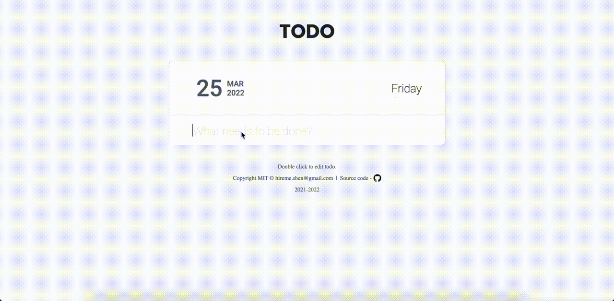

# todo
       

Online Javascript Todo list application. Online preview: [ciaoshen.com](http://ciaoshen.com/todo)

## MVC
This project is developed with MVC pattern. 

### Model(Data)
1. `store.js`: It knows only how to read/write string data from/to `Document.localStorage`.
2. `model.js`: A DAO(Data Access Object) API. It's aware of the data structure of `Item` and other objects. And knows how to `insert`, `update`, `delete` and `read` these data.

### View(DOM)
1. `view.js`: All DOM manipulations go to this file. 
2. `template.js`: A helper of `view.js`. Only used to store HTML templates.

### Controller(Dispatcher)
1. `controller.js`: A general manager. He is the only one who knows all the logic of different features. But he is blind from both data and DOM. `model.js` and `view.js` do these concrete tasks for him.

### Local Storage
Data is stored in browser's `Document.localStorage`. Refresh the page or close the browser will not cause to lose user's todo list.

## Design Style
Inspired by Github design style (including color palette). Keep everything simple but robust.

Happy coding!